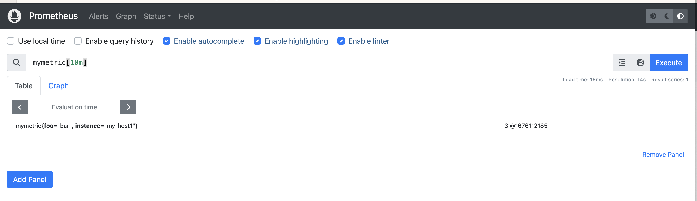

# Prometheus Metric Pusher

Simple program that pushes metrics directly to Prometheus over [remote write protocol](https://prometheus.io/docs/prometheus/latest/storage/#overview).

## Build

You need to have Go installed locally.

```bash
git clone https://github.com/kshcherban/prometheus-metric-pusher
cd prometheus-metric-pusher
go build
```

## Usage

Start Prometheus server with special flag:
```bash
docker run --rm -ti -p 9090:9090 quay.io/prometheus/prometheus \
  --web.enable-remote-write-receiver --config.file=/etc/prometheus/prometheus.yml
```

Run prometheus-metric-pusher:

```
./prometheus-metric-pusher -metric mymetric -value 3 -label instance=my-host1 -label foo=bar
```

To see all available CLI options run with `-h` option.

In Prometheus you will see you metric as follow:

